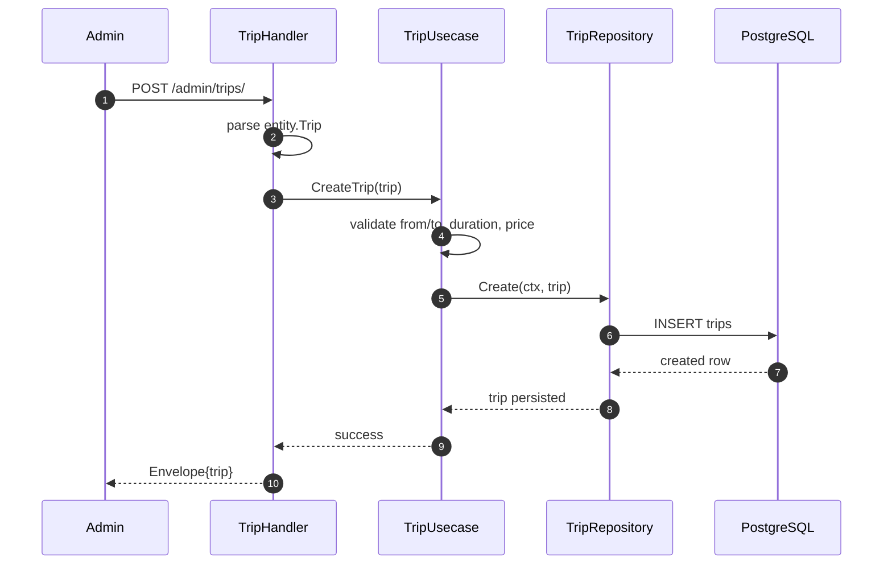
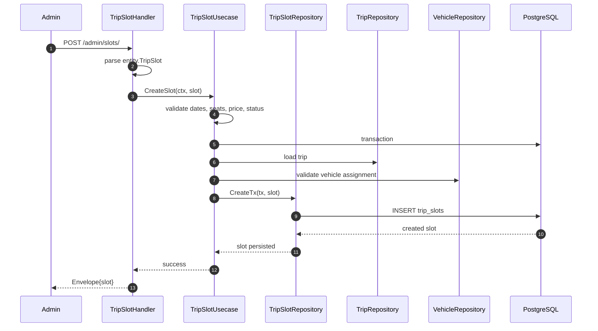
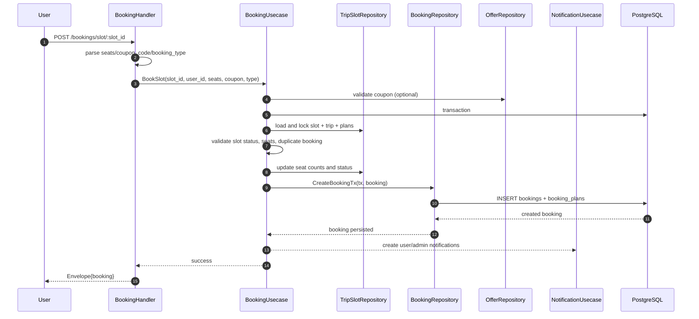
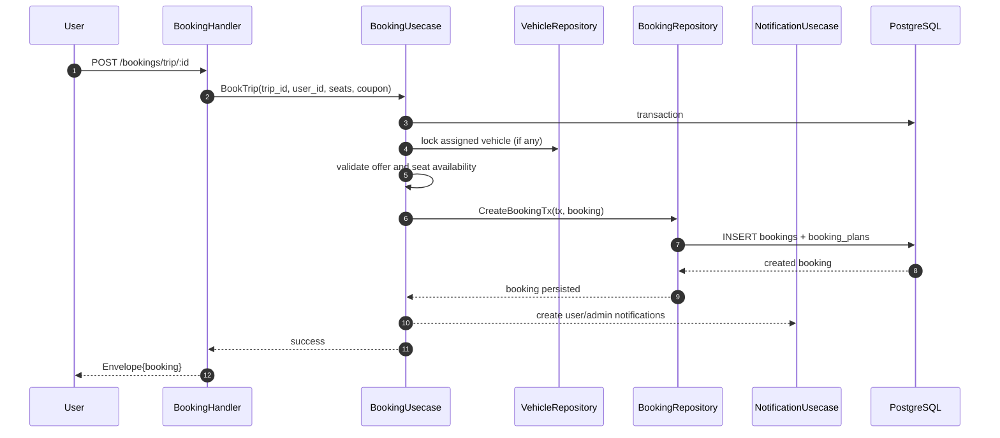
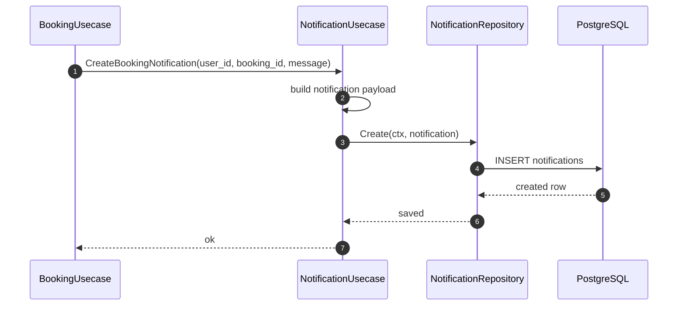
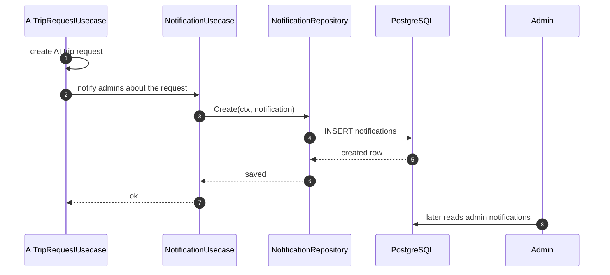
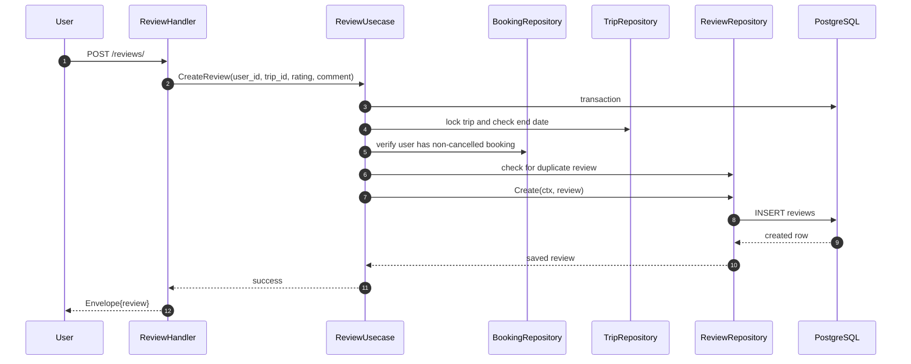
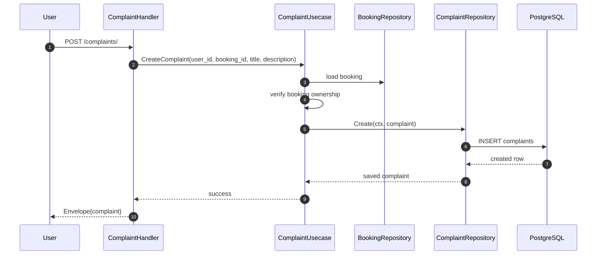
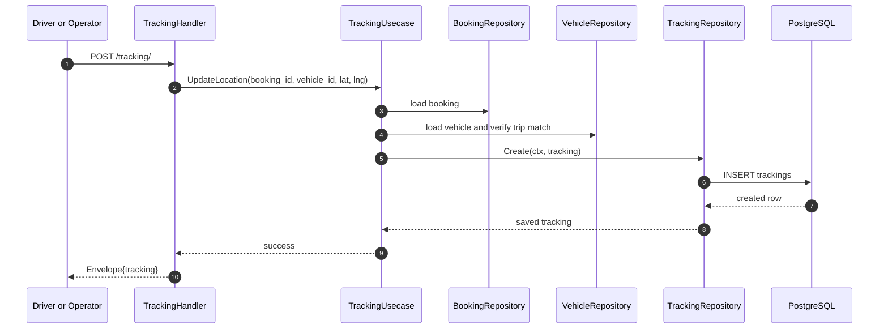
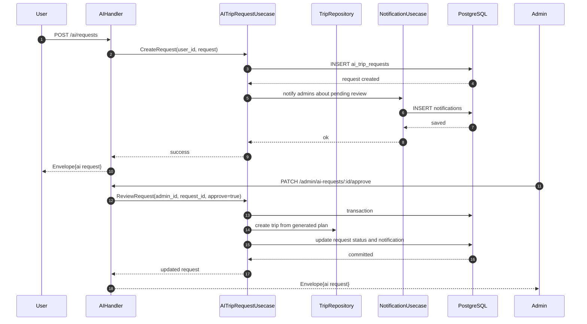

# Business Flow Documentation

The diagrams below are based on the actual handlers and use cases in the repository.

## Trip Creation

Notes:

- File locations: `internal/handler/trip_handler.go`, `internal/usecase/trip_usecase.go`, `internal/repository/trip_repository.go`
- Tables touched: `trips`

## Slot Creation

Notes:

- Slot creation also enforces overlap checks for vehicle, guide, and driver assignment IDs.
- File locations: `internal/handler/trip_slot_handler.go`, `internal/usecase/trip_slot_usecase.go`, `internal/repository/trip_slot_repository.go`
- Tables touched: `trip_slots`, `trips`, `vehicles`

## Booking

### Slot booking path

### Legacy direct-trip booking path

Notes:

- File locations: `internal/handler/booking_handler.go`, `internal/usecase/booking_usecase.go`, `internal/repository/booking_repo.go`
- Tables touched: `bookings`, `booking_plans`, `trip_slots`, `trips`, `vehicles`, `offers`, `notifications`

## Notifications

### Booking notifications

### AI request notifications

Notes:

- File locations: `internal/usecase/notification_usecase.go`, `internal/repository/notification_repository.go`, `internal/usecase/booking_usecase.go`, `internal/usecase/ai_trip_request_usecase.go`
- Tables touched: `notifications`

## Reviews

Notes:

- Review eligibility is based on trip completion and the existence of a non-cancelled booking.
- File locations: `internal/handler/review_handler.go`, `internal/usecase/review_usecase.go`, `internal/repository/review_repository.go`
- Tables touched: `reviews`, `bookings`, `trips`

## Complaints

Notes:

- Admin review uses the same complaint record and updates only the status field.
- File locations: `internal/handler/complaint_handler.go`, `internal/usecase/complaint_usecase.go`, `internal/repository/complaint_repository.go`
- Tables touched: `complaints`, `bookings`

## Tracking

Notes:

- Admin and driver roles can read tracking for any booking; regular users can only read their own booking tracking.
- File locations: `internal/handler/tracking_handler.go`, `internal/usecase/tracking_usecase.go`, `internal/repository/tracking_repository.go`
- Tables touched: `trackings`, `bookings`, `vehicles`

## AI Requests

Notes:

- File locations: `internal/handler/ai_handler.go`, `internal/usecase/ai_trip_request_usecase.go`, `internal/repository/ai_trip_request_repository.go`
- Tables touched: `ai_trip_requests`, `trips`, `notifications`

## Source Files

- `internal/handler/*`
- `internal/usecase/*`
- `internal/repository/*`
