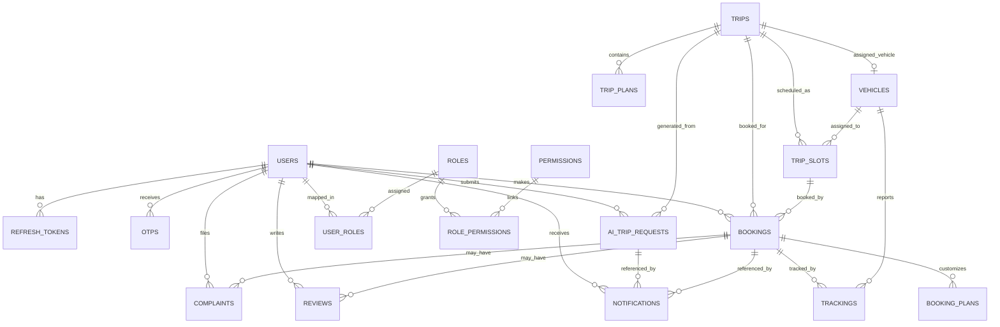

# Database Documentation

This document is derived from the GORM entities and migration code in the repository.

## ER Diagram

## Table Reference

### users

Purpose: store application accounts, cached primary role, and verification/block state.

Columns:

| Column | Type | Constraints / Notes |
| --- | --- | --- |
| `id` | primary key | auto increment |
| `full_name` | varchar(50) | not null |
| `email` | varchar(50) | unique, not null |
| `hash_password` | varchar(255) | stored hashed, not exposed in JSON |
| `role` | varchar(30) | default `user`, not null, indexed |
| `is_blocked` | boolean | default `false`, not null |
| `is_verified` | boolean | default `false`, not null |
| `created_at` | timestamp | auto managed |
| `updated_at` | timestamp | auto managed |

Relationships:

- `has many` `refresh_tokens`
- `has many` `user_roles`
- `has many` `notifications`
- `has many` `bookings`
- `has many` `ai_trip_requests`
- `has many` `reviews`
- `has many` `complaints`

Indexes:

- unique index on `email`
- index on `role`

Foreign keys:

- `refresh_tokens.user_id -> users.id`
- `bookings.user_id -> users.id`
- `user_roles.user_id -> users.id`
- `notifications.user_id -> users.id`
- `ai_trip_requests.user_id -> users.id`
- `reviews.user_id -> users.id`
- `complaints.user_id -> users.id`

Source: `internal/entity/user.go`, `migrations/migrate.go`

### refresh_tokens

Purpose: persist hashed refresh tokens for login/session rotation.

Columns:

| Column | Type | Constraints / Notes |
| --- | --- | --- |
| `id` | primary key | auto increment |
| `user_id` | uint | not null, indexed |
| `token` | text/varchar | unique, not null, stores SHA-256 hash |
| `expired_at` | timestamp | not null |
| `created_at` | timestamp | auto managed |
| `updated_at` | timestamp | auto managed |

Relationships:

- `belongs to` `users`

Indexes:

- unique index on `token`
- index on `user_id`

Foreign keys:

- `user_id -> users.id` with cascade delete

Source: `internal/entity/refresh_token.go`, `internal/usecase/jwt.go`

### otps

Purpose: store hashed OTP codes for signup verification and password reset.

Columns:

| Column | Type | Constraints / Notes |
| --- | --- | --- |
| `id` | primary key | auto increment |
| `email` | varchar(255) | not null |
| `otp_code` | varchar(255) | not null, stores SHA-256 hash |
| `purpose` | varchar(50) | not null, e.g. `signup`, `reset_password` |
| `is_used` | boolean | default `false`, not null |
| `expires_at` | timestamp | not null |
| `created_at` | timestamp | autoCreateTime |

Relationships:

- none enforced at the DB level

Indexes:

- no explicit index tags in the entity

Foreign keys:

- none

Source: `internal/entity/otp.go`, `internal/usecase/otp_verification.go`

### chat_responses

Purpose: auto-migrated storage for AI chat replies.

Columns:

| Column | Type | Constraints / Notes |
| --- | --- | --- |
| `reply` | text | only field defined in the struct |

Relationships:

- none

Indexes:

- none

Foreign keys:

- none

Notes:

- The struct in `internal/entity/ai.go` does not define a primary key.
- No repository or handler currently reads or writes this table.

Source: `internal/entity/ai.go`, `migrations/migrate.go`

### ai_trip_requests

Purpose: store AI-generated trip requests and the admin review outcome.

Columns:

| Column | Type | Constraints / Notes |
| --- | --- | --- |
| `id` | primary key | auto increment |
| `created_at` | timestamp | auto managed |
| `updated_at` | timestamp | auto managed |
| `deleted_at` | soft delete | indexed |
| `user_id` | uint | not null, indexed |
| `from` | varchar(255) | not null |
| `to` | varchar(255) | not null |
| `days` | int | default `1`, not null |
| `trip_type` | varchar(100) | default `Family` |
| `budget_level` | varchar(50) | default `Medium` |
| `members` | int | default `1`, not null |
| `children` | int | default `0`, not null |
| `hotel_type` | varchar(100) | default `3 Star` |
| `transport` | varchar(255) | default `Car` |
| `prompt` | text | not null |
| `generated_plan` | text | not null |
| `status` | varchar(20) | default `pending`, indexed |
| `admin_note` | text | optional |
| `trip_id` | uint nullable | indexed |
| `reviewed_by_id` | uint nullable | indexed |
| `reviewed_at` | timestamp nullable | optional |

Relationships:

- `belongs to` `users` via `user_id`
- `belongs to` `trips` via `trip_id`
- `belongs to` `users` via `reviewed_by_id`

Indexes:

- `user_id`
- `status`
- `trip_id`
- `reviewed_by_id`
- `deleted_at`

Foreign keys:

- `user_id -> users.id` cascade on delete
- `trip_id -> trips.id` cascade on delete
- `reviewed_by_id -> users.id` set null on delete

Source: `internal/entity/ai_trip_request.go`, `internal/usecase/ai_trip_request_usecase.go`

### trips

Purpose: master trip templates and AI-created trips.

Columns:

| Column | Type | Constraints / Notes |
| --- | --- | --- |
| `id` | primary key | auto increment |
| `created_at` | timestamp | auto managed |
| `updated_at` | timestamp | auto managed |
| `deleted_at` | soft delete | indexed |
| `from` | varchar(255) | not null |
| `to` | varchar(255) | not null |
| `start_date` | timestamp | default current timestamp |
| `end_date` | timestamp | default current timestamp |
| `duration` | int | default `1`, not null |
| `trip_type` | varchar(100) | default `Family` |
| `budget_level` | varchar(50) | default `Medium` |
| `price` | decimal(10,2) | default `0.00` |
| `members` | int | default `1` |
| `children` | int | default `0` |
| `hotel_type` | varchar(100) | default `3 Star` |
| `transport` | varchar(255) | default `Car` |
| `itinerary_raw` | text | optional |
| `image_url` | text | optional |
| `status` | varchar(50) | default `active` |

Relationships:

- `has many` `trip_plans`
- `has many` `trip_slots`
- `has many` `bookings`
- `has many` `ai_trip_requests`

Indexes:

- `deleted_at`

Foreign keys:

- `trip_plans.trip_id -> trips.id` cascade on delete
- `trip_slots.trip_id -> trips.id` cascade on delete
- `bookings.trip_id -> trips.id` relation exists in GORM; no explicit delete rule in the struct
- `ai_trip_requests.trip_id -> trips.id` cascade on delete

Source: `internal/entity/trip.go`, `internal/usecase/trip_usecase.go`, `internal/usecase/ai_trip_request_usecase.go`

### trip_plans

Purpose: itinerary items attached to a trip template.

Columns:

| Column | Type | Constraints / Notes |
| --- | --- | --- |
| `id` | primary key | auto increment |
| `created_at` | timestamp | auto managed |
| `updated_at` | timestamp | auto managed |
| `deleted_at` | soft delete | indexed |
| `trip_id` | uint | not null, indexed |
| `day_number` | int | not null |
| `title` | varchar(255) | not null |
| `description` | text | optional |
| `location` | varchar(255) | optional |
| `start_time` | varchar(50) | optional |
| `end_time` | varchar(50) | optional |
| `category` | varchar(50) | optional |
| `cost` | decimal(10,2) | optional |

Relationships:

- `belongs to` `trips`

Indexes:

- composite unique index `idx_trip_day` on `trip_id` + `day_number`
- `deleted_at`

Foreign keys:

- `trip_id -> trips.id` with GORM relation; trip delete cascades through the entity tag

Source: `internal/entity/trip_plan.go`, `internal/usecase/trip_plan_usecase.go`

### trip_slots

Purpose: scheduled departures for a trip template.

Columns:

| Column | Type | Constraints / Notes |
| --- | --- | --- |
| `id` | primary key | auto increment |
| `created_at` | timestamp | auto managed |
| `updated_at` | timestamp | auto managed |
| `trip_id` | uint | not null, indexed |
| `vehicle_id` | uint nullable | indexed |
| `guide_id` | uint nullable | indexed |
| `driver_id` | uint nullable | indexed |
| `start_date` | timestamp | not null, indexed |
| `end_date` | timestamp | not null, indexed |
| `total_seats` | int | default `0`, not null |
| `available_seats` | int | default `0`, not null |
| `booked_seats` | int | default `0`, not null |
| `price_override` | decimal(12,2) | default `0` |
| `status` | varchar(30) | default `scheduled`, indexed |

Relationships:

- `belongs to` `trips`
- `belongs to` `vehicles` through `vehicle_id`
- `guide_id` and `driver_id` are raw columns only; no entity or FK exists in the current code
- `has many` `bookings`

Indexes:

- `trip_id`
- `vehicle_id`
- `guide_id`
- `driver_id`
- `start_date`
- `end_date`
- `status`

Foreign keys:

- `trip_id -> trips.id` cascade on delete
- `vehicle_id -> vehicles.id` set null on delete
- no FK for `guide_id` or `driver_id`

Source: `internal/entity/trip_slot.go`, `internal/usecase/trip_slot_usecase.go`

### bookings

Purpose: store customer bookings for either a trip template or a specific slot.

Columns:

| Column | Type | Constraints / Notes |
| --- | --- | --- |
| `id` | primary key | auto increment |
| `created_at` | timestamp | auto managed |
| `updated_at` | timestamp | auto managed |
| `user_id` | uint | not null, indexed, part of `idx_booking_user_slot` |
| `trip_id` | uint | not null, indexed |
| `slot_id` | uint nullable | indexed, part of `idx_booking_user_slot` |
| `vehicle_id` | uint nullable | indexed |
| `offer_id` | uint nullable | indexed |
| `booking_type` | varchar(20) | default `shared` |
| `status` | varchar(50) | default `pending` |
| `seats_booked` | int | default `1`, not null |
| `coupon_code` | varchar(100) | optional |
| `discount_percent` | decimal(5,2) | default `0` |
| `base_amount` | decimal(12,2) | default `0` |
| `final_amount` | decimal(12,2) | default `0` |

Relationships:

- `belongs to` `trips`
- `belongs to` `users`
- `belongs to` `trip_slots`
- `belongs to` `vehicles`
- `belongs to` `offers`
- `has many` `booking_plans`

Indexes:

- `user_id`
- `trip_id`
- `slot_id`
- `vehicle_id`
- `offer_id`
- composite unique index `idx_booking_user_slot` on `user_id` + `slot_id`

Foreign keys:

- `slot_id -> trip_slots.id` set null on delete
- `vehicle_id -> vehicles.id` set null on delete
- `offer_id -> offers.id` set null on delete
- `booking_plans.booking_id -> bookings.id` cascade on delete
- `trip_id -> trips.id` relation exists in GORM; no explicit delete rule in the struct
- `user_id -> users.id`

Source: `internal/entity/booking.go`, `internal/usecase/booking_usecase.go`, `internal/repository/booking_repo.go`

### booking_plans

Purpose: store a booking's copied itinerary so users can customize their version.

Columns:

| Column | Type | Constraints / Notes |
| --- | --- | --- |
| `id` | primary key | auto increment |
| `booking_id` | uint | not null, indexed |
| `day_number` | int | not null |
| `title` | varchar(255) | not null |
| `description` | text | optional |
| `location` | varchar(255) | optional |
| `start_time` | varchar(50) | optional |
| `end_time` | varchar(50) | optional |
| `category` | varchar(50) | optional |
| `cost` | decimal(10,2) | optional |

Relationships:

- `belongs to` `bookings`

Indexes:

- `booking_id`

Foreign keys:

- `booking_id -> bookings.id` cascade on delete

Source: `internal/entity/booking.go`, `internal/repository/booking_repo.go`

### notifications

Purpose: user, booking, and AI request notifications.

Columns:

| Column | Type | Constraints / Notes |
| --- | --- | --- |
| `id` | primary key | auto increment |
| `created_at` | timestamp | auto managed |
| `updated_at` | timestamp | auto managed |
| `user_id` | uint | not null, indexed |
| `type` | varchar(50) | default `general`, indexed |
| `title` | varchar(150) | not null |
| `message` | text | not null |
| `booking_id` | uint nullable | indexed |
| `ai_trip_request_id` | uint nullable | indexed |
| `is_read` | boolean | default `false`, indexed |
| `is_admin` | boolean | default `false` |
| `metadata` | text | optional |

Relationships:

- `belongs to` `users`
- `belongs to` `bookings`
- `belongs to` `ai_trip_requests`

Indexes:

- `user_id`
- `type`
- `booking_id`
- `ai_trip_request_id`
- `is_read`

Foreign keys:

- `user_id -> users.id` cascade on delete
- `booking_id -> bookings.id` cascade on delete
- `ai_trip_request_id -> ai_trip_requests.id` cascade on delete

Source: `internal/entity/notification.go`, `internal/usecase/notification_usecase.go`

### roles

Purpose: canonical role definitions used by RBAC.

Columns:

| Column | Type | Constraints / Notes |
| --- | --- | --- |
| `id` | primary key | auto increment |
| `name` | varchar(50) | unique, not null |
| `description` | text | optional |
| `created_at` | timestamp | auto managed |
| `updated_at` | timestamp | auto managed |

Relationships:

- `has many` `user_roles`
- `has many` `role_permissions`

Indexes:

- unique index on `name`

Foreign keys:

- `user_roles.role_id -> roles.id` cascade on delete
- `role_permissions.role_id -> roles.id` cascade on delete

Source: `internal/entity/role.go`, `internal/usecase/role_usecase.go`

### user_roles

Purpose: join table between users and roles, with a primary-role flag.

Columns:

| Column | Type | Constraints / Notes |
| --- | --- | --- |
| `id` | primary key | auto increment |
| `user_id` | uint | not null, indexed, part of `idx_user_role` |
| `role_id` | uint | not null, indexed, part of `idx_user_role` |
| `is_primary` | boolean | default `true`, indexed |
| `created_at` | timestamp | auto managed |
| `updated_at` | timestamp | auto managed |

Relationships:

- `belongs to` `users`
- `belongs to` `roles`

Indexes:

- composite unique index `idx_user_role` on `user_id` + `role_id`
- index on `is_primary`

Foreign keys:

- `user_id -> users.id` cascade on delete
- `role_id -> roles.id` cascade on delete

Source: `internal/entity/role.go`, `internal/usecase/role_usecase.go`

### permissions

Purpose: canonical permission definitions for the RBAC layer.

Columns:

| Column | Type | Constraints / Notes |
| --- | --- | --- |
| `id` | primary key | auto increment |
| `key` | varchar(100) | unique, not null |
| `name` | varchar(150) | not null |
| `description` | text | optional |
| `created_at` | timestamp | auto managed |
| `updated_at` | timestamp | auto managed |

Relationships:

- `has many` `role_permissions`

Indexes:

- unique index on `key`

Foreign keys:

- `role_permissions.permission_id -> permissions.id` cascade on delete

Source: `internal/entity/permission.go`, `internal/usecase/permission_usecase.go`

### role_permissions

Purpose: join table between roles and permissions.

Columns:

| Column | Type | Constraints / Notes |
| --- | --- | --- |
| `id` | primary key | auto increment |
| `role_id` | uint | not null, indexed, part of `idx_role_permission` |
| `permission_id` | uint | not null, indexed, part of `idx_role_permission` |
| `created_at` | timestamp | auto managed |
| `updated_at` | timestamp | auto managed |

Relationships:

- `belongs to` `roles`
- `belongs to` `permissions`

Indexes:

- composite unique index `idx_role_permission` on `role_id` + `permission_id`

Foreign keys:

- `role_id -> roles.id` cascade on delete
- `permission_id -> permissions.id` cascade on delete

Source: `internal/entity/role_permission.go`, `internal/usecase/permission_usecase.go`

### vehicles

Purpose: fleet inventory with optional trip assignment.

Columns:

| Column | Type | Constraints / Notes |
| --- | --- | --- |
| `id` | primary key | auto increment |
| `created_at` | timestamp | auto managed |
| `updated_at` | timestamp | auto managed |
| `agency_id` | uint | not null, indexed |
| `name` | varchar(150) | not null |
| `type` | varchar(50) | not null, indexed |
| `total_seats` | int | not null |
| `available_seats` | int | not null |
| `price_per_person` | decimal(12,2) | default `0` |
| `status` | varchar(30) | default `active`, indexed |
| `trip_id` | uint nullable | indexed, unique when present via `idx_vehicle_trip` |

Relationships:

- `belongs to` `users` through `agency_id`
- `belongs to` `trips` through `trip_id`
- `has many` `trip_slots`

Indexes:

- `agency_id`
- `type`
- `status`
- `trip_id`
- unique composite/nullable constraint `idx_vehicle_trip`

Foreign keys:

- `agency_id -> users.id` cascade on delete
- `trip_id -> trips.id` set null on delete

Source: `internal/entity/vehicle.go`, `internal/usecase/vehicle_usecase.go`

### offers

Purpose: coupon and discount offers used by booking flows.

Columns:

| Column | Type | Constraints / Notes |
| --- | --- | --- |
| `id` | primary key | auto increment |
| `created_at` | timestamp | auto managed |
| `updated_at` | timestamp | auto managed |
| `code` | varchar(100) | unique, not null |
| `title` | varchar(150) | not null |
| `description` | text | optional |
| `discount_percent` | decimal(5,2) | not null, default `0` |
| `expiry_date` | timestamp | not null, indexed |
| `active` | boolean | default `true`, indexed |

Relationships:

- `has many` `bookings`

Indexes:

- unique index on `code`
- index on `expiry_date`
- index on `active`

Foreign keys:

- referenced by `bookings.offer_id`

Source: `internal/entity/offer.go`, `internal/usecase/offer_usecase.go`

### reviews

Purpose: trip reviews submitted by customers.

Columns:

| Column | Type | Constraints / Notes |
| --- | --- | --- |
| `id` | primary key | auto increment |
| `created_at` | timestamp | auto managed |
| `updated_at` | timestamp | auto managed |
| `user_id` | uint | not null, indexed, part of `idx_user_trip_review` |
| `trip_id` | uint | not null, indexed, part of `idx_user_trip_review` |
| `rating` | int | not null, indexed |
| `comment` | text | optional |

Relationships:

- `belongs to` `users`
- `belongs to` `trips`

Indexes:

- composite unique index `idx_user_trip_review` on `user_id` + `trip_id`
- index on `rating`

Foreign keys:

- `user_id -> users.id` cascade on delete
- `trip_id -> trips.id` cascade on delete

Source: `internal/entity/review.go`, `internal/usecase/review_usecase.go`

### complaints

Purpose: booking complaints and support cases.

Columns:

| Column | Type | Constraints / Notes |
| --- | --- | --- |
| `id` | primary key | auto increment |
| `created_at` | timestamp | auto managed |
| `updated_at` | timestamp | auto managed |
| `user_id` | uint | not null, indexed |
| `booking_id` | uint | not null, indexed |
| `title` | varchar(150) | not null |
| `description` | text | not null |
| `status` | varchar(30) | default `pending`, indexed |

Relationships:

- `belongs to` `users`
- `belongs to` `bookings`

Indexes:

- `user_id`
- `booking_id`
- `status`

Foreign keys:

- `user_id -> users.id` cascade on delete
- `booking_id -> bookings.id` cascade on delete

Source: `internal/entity/complaint.go`, `internal/usecase/complaint_usecase.go`

### trackings

Purpose: store location updates for bookings and vehicles.

Columns:

| Column | Type | Constraints / Notes |
| --- | --- | --- |
| `id` | primary key | auto increment |
| `created_at` | timestamp | auto managed |
| `updated_at` | timestamp | auto managed |
| `booking_id` | uint | not null, indexed |
| `vehicle_id` | uint | not null, indexed |
| `latitude` | float | not null |
| `longitude` | float | not null |

Relationships:

- `belongs to` `bookings`
- `belongs to` `vehicles`

Indexes:

- `booking_id`
- `vehicle_id`

Foreign keys:

- `booking_id -> bookings.id` cascade on delete
- `vehicle_id -> vehicles.id` cascade on delete

Source: `internal/entity/tracking.go`, `internal/usecase/tracking_usecase.go`

## Notes and Schema Observations

- `Trip`, `TripPlan`, and `AITripRequest` use soft deletes through `gorm.DeletedAt`.
- `BookingPlan` has no timestamps in the struct, so the table is intentionally minimal.
- `ChatResponse` is migrated but currently unused.
- `TripSlot.GuideID` and `TripSlot.DriverID` are present in the schema, but there are no corresponding guide or driver entities yet.
- `bookings.trip_id` has a relation, but the entity does not declare an explicit `OnDelete` rule in the struct.

## Source Files

- `internal/entity/*.go`
- `migrations/migrate.go`
- `migrations/*.go`
