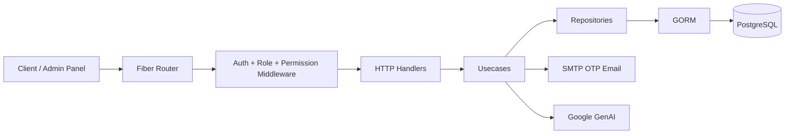

# System Architecture

## Layer Diagram

## Request Lifecycle
1. `cmd/server/main.go` starts by loading environment variables and validating the required startup configuration.
2. The app connects to PostgreSQL through `internal/config/databse.go`.
3. Migrations run via `migrations/Migrations()`.
4. Seeders populate users and RBAC data.
5. Fiber is created with the shared error handler in `internal/response/response.go`.
6. Requests enter auth middleware, which extracts a bearer token or `access_token` cookie, validates the JWT, and loads the caller from the database.
7. Role and permission middleware decide whether the route can continue.
8. Handlers parse the request body or path params into DTOs or entity structs.
9. Usecases enforce business rules and wrap multi-step writes in transactions.
10. Repositories issue GORM queries and return entities.
11. Handlers map results to response DTOs and return the shared envelope.

## Service Interactions
- Auth flow: `internal/handler/auth_handler.go` -> `internal/usecase/jwt.go` and `internal/usecase/otp_verification.go`.
- AI flow: `internal/handler/ai_handler.go` -> `internal/usecase/ai_trip_request_usecase.go` and optional `google.golang.org/genai`.
- Booking flow: `internal/handler/booking_handler.go` -> `internal/usecase/booking_usecase.go` -> booking, trip slot, offer, user, and notification repositories.
- RBAC flow: `internal/handler/role_handler.go` and `internal/handler/permission_handler.go` -> role and permission usecases/repositories.
- Tracking flow: `internal/handler/tracking_handler.go` -> `internal/usecase/tracking_usecase.go` -> tracking, booking, and vehicle repositories.

## External Integrations
- PostgreSQL for persistence.
- SMTP mail server for OTP delivery.
- Google GenAI for trip-plan generation when `GEMINI_API_KEY` is configured.
- JWT for session tokens.

## What Is Not Present
- No websocket server.
- No queue, worker, or cron system.
- No payment gateway integration.
- No object storage or cache integration.
- No Docker or CI/CD automation in the repository snapshot.

## Notes On Design
- Business rules are centralized in usecases rather than handlers.
- Most writes that touch multiple tables use GORM transactions.
- Row locking is used for refresh-token rotation, AI request review, review creation, and slot booking.
- The codebase still contains a few legacy or compatibility paths, most notably `POST /bookings/trip/:id`.

